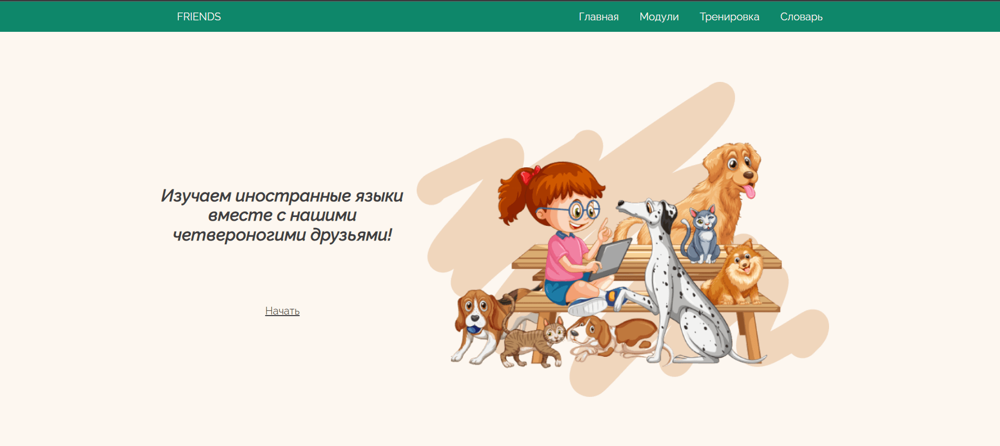
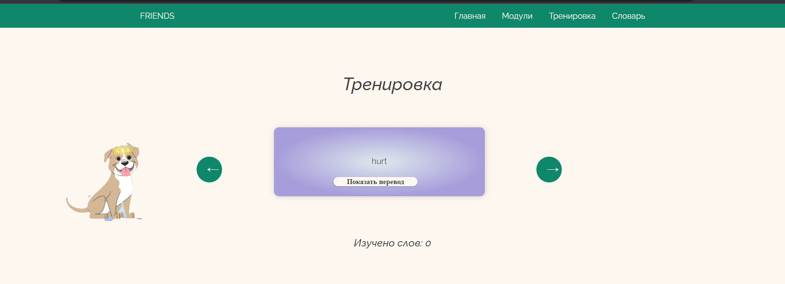
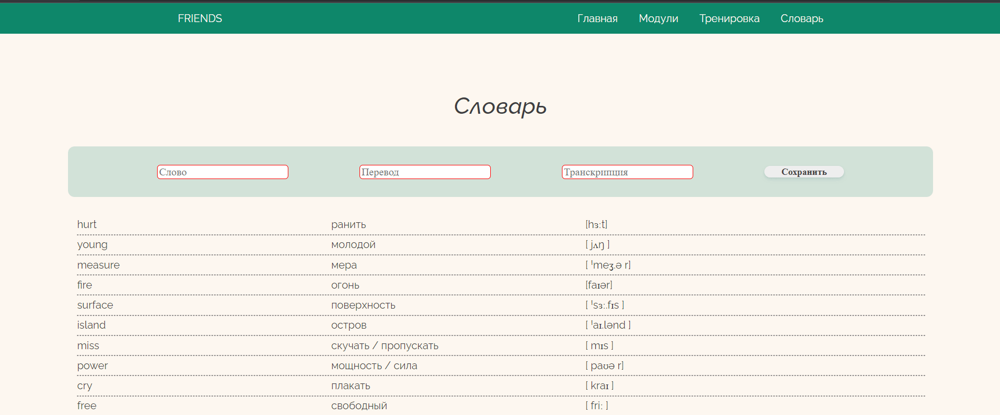

# Foreign Word Learning App

This application is designed to help users learn foreign words efficiently.\
Built using React, it provides an interactive environment for users to engage with new vocabulary.

## Features
Interactive Cards: Words are presented in the form of interactive cards, allowing users to see translations when they feel ready.\
Word Database: A growing list of words from different categories to help users expand their vocabulary.\
User-friendly Interface: Simple and intuitive design that makes the learning process smooth.

## Technologies

&nbsp;
&nbsp;

## Installation
To run the project locally, follow the steps below:

Clone the repository:.\
1.git clone [https://github.com/your-username/react-comments-app.git](https://github.com/your-github-username/foreign-word-learning-app.git)
### `cd foreign-word-learning-app`

2.Install the dependencies:
### `npm install`

3.Run the project:
### `npm start`

Open [http://localhost:3000](http://localhost:3000) to view it in your browser.
